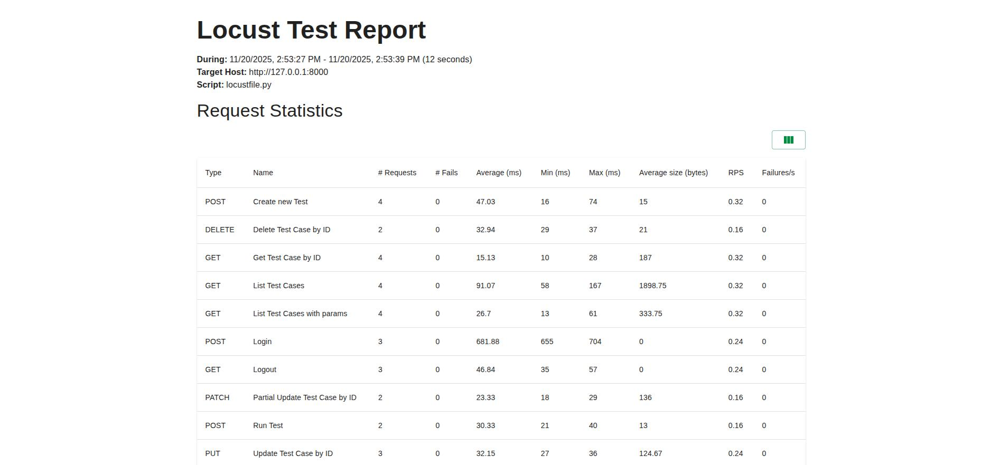

# TestMe Load Tests

Load test suite for [TestMe App](https://github.com/Ypurek/TestMe-TCM) - a Test Case Management system.

## Quick Start

```bash
# Install dependencies
make install

# Run load tests
make test
```

## Tech Stack

**Core packages:**
- `locust` - load testing framework
- `requests` - HTTP client
- `uv` - Python package manager

## Project Structure

### Data Layer (`data/`)
Test data generation and management:
- `test_data.py` - test data generation utilities
- `users.csv` - user credentials for authentication
- `config.yml` - (deprecated, moved to root)

### Utils Modules (`utils/`)
- `logger.py` - custom logger for HTTP requests/responses (saves to files with timestamps)
- `utils.py` - HTTP request utilities (headers, token extraction)
- `users_loader.py` - CSV user loader for authentication

### Tests (`tests/`)
- `test_tests.py` - test CRUD operations load tests
- `test_lists.py` - test list operations load tests
- `test_stats.py` - statistics load tests
- `abstract_user.py` - abstract base class for HTTP users
- `register_user.py` - registered user with login/logout functionality

## Implementation Details

### Locust Task-based Load Testing
Uses Locust framework with HttpUser, TaskSet, and SequentialTaskSet:
- **HttpUser** - simulates concurrent users
- **TaskSet** - groups related tasks
- **SequentialTaskSet** - executes tasks in sequence (e.g., Create -> Get -> Update -> Delete)
- **@task** decorator - defines task execution frequency and order

### Request/Response Logging
- **File logging**: detailed HTTP requests/responses in `logs/log_*.log` for debugging
- Each log entry includes:
  - Task name and timestamp
  - Request method, URL, and body
  - Response code, text, headers, and cookies
  - Task execution result

Logging is integrated at the task level - all HTTP requests are automatically logged via `Logger` utility.

### Data-driven Approach
User credentials are loaded from CSV file (`data/users.csv`) for authentication. Test data is generated dynamically using timestamps to ensure uniqueness.

### Load Test Configuration
Configuration is managed via `config.yml`:
- `locustfile` - path to test files (default: `locustfile.py`)
- `host` - target API host
- `users` - number of concurrent users
- `spawn-rate` - user spawn rate per second
- `headless` - run in headless mode (no web UI)
- `run-time` - test duration

## Docker

Project is containerized for consistent test execution:

```bash
# Build image
make docker-build

# Run load tests in Docker
make docker-test

# Open shell in container
make docker-shell

# Clean up Docker resources
make docker-clean
```

Dockerfile uses Python 3.11 slim image and uv for fast dependency installation.

## Reports and Logs

**HTML Reports** (`reports/report.html`):
- Comprehensive test execution summary
- Statistics for each endpoint (request count, failures, response times)
- Response time percentiles (50th, 66th, 75th, 80th, 90th, 95th, 98th, 99th, 99.9th, 99.99th, 100th)
- Request rate (requests per second)
- Failure rate and error details
- User count and spawn rate over time
- Charts and graphs for visualization

**CSV Reports** (`reports/stats*.csv`):
- `stats_stats.csv` - detailed statistics for each endpoint
- `stats_failures.csv` - list of failed requests
- `stats_exceptions.csv` - exceptions that occurred during test execution

**File Logs** (`logs/log_*.log`):
- Complete HTTP interaction information
- Timestamp for each request
- Request method, URL, headers, and body
- Response code, text, headers, and cookies
- Task execution results

Folders `reports/` and `logs/` are automatically created when running tests via Makefile or Docker.

## Test Execution Examples

### HTML Report Example

Generated HTML report (`reports/report.html`) provides a comprehensive view of load test execution:



The report includes:
- Test execution summary with request statistics
- Statistics for each endpoint (request count, failures, response times)
- Response time percentiles (50th, 66th, 75th, 80th, 90th, 95th, 98th, 99th, 99.9th, 99.99th, 100th)
- Request rate (requests per second)
- Failure rate and error details
- User count and spawn rate over time
- Charts and graphs for visualization

### Log File Example

Each HTTP request and response is logged with detailed information in `logs/log_*.log`:

```
-----
Task: User Login
Time: 2025-11-20 21:00:38.451326
Request method: POST
Request URL: /api/auth/login
Request Body: {
  "username": "alice",
  "password": "Qamania123"
}

Task result: Login successfully for user: alice
Response code: 200
Response text: 
Response headers: {'Date': 'Thu, 20 Nov 2025 21:00:41 GMT', 'Server': 'WSGIServer/0.2 CPython/3.11.14', 'Content-Type': 'text/html; charset=utf-8', 'X-Frame-Options': 'DENY', 'Vary': 'Cookie', 'Content-Length': '0', 'X-Content-Type-Options': 'nosniff', 'Referrer-Policy': 'same-origin', 'Cross-Origin-Opener-Policy': 'same-origin', 'Set-Cookie': 'csrftoken=hxSNTUDgeeZmjmAhdNtheowSKujO5vwu; expires=Thu, 19 Nov 2026 21:00:41 GMT; Max-Age=31449600; Path=/; SameSite=Lax, sessionid=9ho0yfdmmr4wprprn3125jyftvxbra56; expires=Thu, 04 Dec 2025 21:00:41 GMT; HttpOnly; Max-Age=1209600; Path=/; SameSite=Lax'}
Response cookies: {'csrftoken': 'hxSNTUDgeeZmjmAhdNtheowSKujO5vwu', 'sessionid': '9ho0yfdmmr4wprprn3125jyftvxbra56'}

-----
Task: Create Test
Time: 2025-11-20 21:00:41.033176
Request method: POST
Request URL: /api/tests/new
Request Body: {
  "name": "API Test 1763672441033",
  "description": "Checking the creation of a new test by alice. Endpoint: /api/tests/new"
}

Task result: Test successfully created by user: alice
Response code: 201
Response text: {"test_id": 49}
Response headers: {'Date': 'Thu, 20 Nov 2025 21:00:41 GMT', 'Server': 'WSGIServer/0.2 CPython/3.11.14', 'Content-Type': 'application/json', 'X-Frame-Options': 'DENY', 'Content-Length': '15', 'Vary': 'Cookie', 'X-Content-Type-Options': 'nosniff', 'Referrer-Policy': 'same-origin', 'Cross-Origin-Opener-Policy': 'same-origin'}
Response cookies: {}

-----
```

Each log entry includes:
- Task name and timestamp for precise tracking
- Complete HTTP request details (method, URL, body with formatted JSON)
- Complete HTTP response details (status code, headers, body, cookies)
- Task execution result (success/failure message)
- Request/response separation for easy navigation

## Configuration

Load test configuration is defined in `config.yml`:
- `locustfile` - path to test files (default: `locustfile.py`)
- `host` - target API host (default: `http://127.0.0.1:8000`)
- `users` - number of concurrent users (default: 3)
- `spawn-rate` - user spawn rate per second (default: 6)
- `headless` - run in headless mode (default: true)
- `run-time` - test duration (default: 15s)

## Available Commands

### Setup
```bash
make install       # Install dependencies with uv (including dev tools)
```

### Testing
```bash
make test          # Run Locust load tests
```

### Docker
```bash
make docker-build   # Build Docker image
make docker-test    # Run load tests in Docker
make docker-shell   # Open shell in Docker container
make docker-clean   # Remove Docker containers and images
```

### Maintenance
```bash
make clean         # Remove cache artifacts, reports, and logs
make help          # Show all available commands
```

---

**Release Notes:** See [RELEASE.md](RELEASE.md) for version history and changelog.

**API Documentation:** https://documenter.getpostman.com/view/2037649/UV5TEe6x

**TestMe App Repository:** https://github.com/Ypurek/TestMe-TCM

